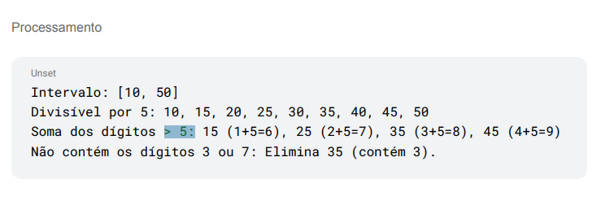

# Números Escondidos

Repositório com a resposta para o exercício 1 (O Quebra-Cabeça dos Números Escondidos).

## Requisitos

- .NET 9.0.201 ou superior

## Execução

O projeto consiste de uma Console Application.
A Console Application possui uma classe `Solucao.cs` que consiste de métodos para solução do projeto e possui uma classe `Program.cs` que possui o teste para rodar o projeto.

Para executar o projeto, siga os passos abaixo:

1. Abra o terminal na pasta raiz do projeto.
2. Execute o comando `dotnet run --project src/QuebraCabeca.Console`.
3. O resultado dos testes será impresso no terminal.

## Duvida na questão

Na descrição da atividade esta pedindo para resolver considerando que a soma dos dígitos deve ser **Maior ou Igual D** como esta na imagem abaixo.

Porem no exemplo de Processamento esta mostrando uma logica utilizando comparação de **Maior que D**:

Dentro do arquivo `solucao.cs` tem métodos para resolver os dois casos, pois seguindo o exemplo de processamento retornara 15,25,45 e seguindo a descrição da questão retornara 15,25,45,50
